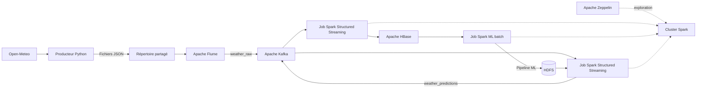

<p align="center">
    
    
    
    
    
    
    
    
</p>

<p align="center">
    
    
    
    
</p>

# Weather Data Platform

> Projet de portfolio Big Data : collecte, transport, traitement distribué et exploitation de données météorologiques avec une stack conteneurisée.

Cette plateforme de démonstration récupère les observations météo courantes de Londres via l’API [Open-Meteo](https://open-meteo.com/). Un producteur Python écrit des événements JSON dans un répertoire surveillé par Apache Flume. Flume les publie dans Kafka, où des applications Spark peuvent les consommer pour alimenter HBase ou réaliser une inférence ML en continu.

> **État du projet :** les services d’infrastructure sont définis dans Docker Compose et les applications de traitement sont fournies séparément. Le démarrage des conteneurs ne lance pas automatiquement les jobs Spark. Certaines intégrations et dépendances restent à configurer avant de considérer le parcours complet comme opérationnel.

## Objectifs

- Construire un pipeline de données réparti entre ingestion, transport, calcul et stockage.
- Manipuler des flux d’événements JSON et des traitements batch avec Spark.
- Explorer le stockage orienté colonnes avec HBase et le stockage distribué HDFS.
- Entraîner un modèle de régression Spark ML et enregistrer son pipeline dans HDFS.
- Déployer et isoler les composants à l’aide de Docker Compose.

## Architecture



Les flèches décrivent le flux visé par les configurations et scripts du dépôt. Les applications Spark ne sont pas démarrées automatiquement par Compose et doivent être soumises séparément.

## Composants

| Composant | Rôle dans le projet |
| --- | --- |
| Open-Meteo | Source externe des observations météo courantes pour Londres. |
| Producteur Python | Transforme la réponse API en événement JSON enrichi d’un identifiant et d’un horodatage d’ingestion. |
| Apache Flume | Surveille le répertoire de spool et transfère les événements vers Kafka. |
| Apache Kafka | Tamponne et distribue les événements sur le topic `weather_raw`. |
| Apache Spark | Fournit le cluster de calcul et les jobs Structured Streaming / ML. |
| Apache HBase | Stockage NoSQL ciblé par le job d’ingestion Spark. |
| HDFS | Stockage du modèle entraîné sous `hdfs://namenode-bd:9000/models/weather_v1`. |
| Apache Zeppelin | Environnement de notebooks relié au cluster Spark. |
| ZooKeeper | Coordination configurée pour Kafka et HBase dans cette stack de démonstration. |

## Concepts d’ingénierie

- **Découplage par événements :** le producteur ne dépend pas directement du consommateur final. Flume et Kafka forment des étapes intermédiaires entre la collecte et les traitements.
- **Streaming et batch :** `ingest_hbase.py` et `streaming_inference.py` consomment Kafka avec Spark Structured Streaming ; `batch_ml_train.py` lit les données HBase pour entraîner un modèle.
- **Contrat de données :** les jobs Spark déclarent un schéma explicite pour interpréter les messages JSON, plutôt que de s’appuyer uniquement sur une inférence implicite.
- **Traitement distribué par partition :** l’écriture HBase utilise `foreachPartition`, ce qui permet de traiter les lignes côté workers au lieu de rapatrier tout le flux sur le driver.
- **Feature engineering et pipeline ML :** `VectorAssembler` construit le vecteur de caractéristiques, puis un `Pipeline` regroupe la transformation et la régression linéaire.
- **Persistance d’artefact :** le modèle Spark ML est enregistré dans HDFS et peut être chargé par le job d’inférence.
- **Isolation et données persistantes :** Docker Compose définit le réseau de services et des volumes nommés pour HDFS et HBase ; le volume partagé sert au spool Flume et aux fichiers partagés.

## Prérequis

- Docker Engine et Docker Compose (commande `docker compose` ou `docker-compose`).
- Accès réseau à l’API Open-Meteo lors de l’exécution du producteur.
- Ressources suffisantes pour plusieurs conteneurs Big Data ; cette stack est destinée au développement local, pas à un cluster hautement disponible.

## Démarrage de l’infrastructure

Depuis la racine du dépôt :

```bash
docker compose up -d --build
docker compose ps
```

Pour consulter les journaux :

```bash
docker compose logs -f producer
docker compose logs -f flume kafka spark-master
```

Pour arrêter les services sans supprimer les volumes de données :

```bash
docker compose down
```

Pour supprimer aussi les volumes persistants (données HDFS/HBase incluses) :

```bash
docker compose down -v
```

## Interfaces locales

| Service | Adresse exposée par Compose |
| --- | --- |
| Zeppelin | [http://localhost:9999](http://localhost:9999) |
| Spark Master UI | [http://localhost:8080](http://localhost:8080) |
| Spark Worker UI | [http://localhost:8081](http://localhost:8081) |
| HDFS NameNode UI | [http://localhost:9870](http://localhost:9870) |
| Kafka | `localhost:9092` |
| ZooKeeper | `localhost:2181` |

Les ports d’administration HBase et de son API REST ne sont pas publiés sur l’hôte dans le Compose actuel.

## Applications Spark

Les scripts se trouvent dans `spark_apps/` :

- `ingest_hbase.py` : lit `weather_raw` et écrit les micro-batches dans la table HBase `weather_history`.
- `batch_ml_train.py` : lit les données via l’API REST HBase, entraîne une régression linéaire et sauvegarde le modèle dans HDFS.
- `streaming_inference.py` : charge le modèle depuis HDFS, consomme `weather_raw` et publie les prédictions sur `weather_predictions`.
- `verify_connection.py` : vérifie une connexion Thrift à HBase et teste une écriture/lecture.

Les jobs doivent être soumis au cluster Spark séparément. Par exemple, depuis un environnement où `spark-submit` est installé et où le fichier est accessible :

```bash
spark-submit --master spark://localhost:7077 spark_apps/batch_ml_train.py
```

Ce job suppose qu’HBase contient déjà des données et que son endpoint REST est disponible depuis le processus Spark. Les jobs streaming ont aussi besoin de leurs dépendances Kafka et, pour l’écriture HBase, de `happybase` et Thrift côté workers. Ces prérequis ne sont pas tous installés/configurés par les images Compose actuelles ; les commandes de soumission sont donc à adapter à l’environnement Spark choisi.

## Structure du dépôt

```text
.
├── docker-compose.yml
├── hadoop.env
├── flume/
│   ├── Dockerfile
│   └── conf/flume.conf
├── producer/
│   ├── Dockerfile
│   ├── extract_final.py
│   └── requirements.txt
├── spark_apps/
│   ├── batch_ml_train.py
│   ├── ingest_hbase.py
│   ├── streaming_inference.py
│   └── verify_connection.py
├── scripts/init_hbase.txt
└── zeppelin/
    ├── Dockerfile
    └── notebooks/
```

## Limites connues et pistes d’amélioration

Le dépôt est un laboratoire local qui illustre plusieurs briques Big Data ; il ne constitue pas encore une plateforme de production. Les points suivants sont importants pour l’exploitation et la fiabilité :

- Le producteur cible 20 000 appels et interroge l’API toutes les 0,5 seconde. Ajouter une fréquence adaptée aux quotas, des tentatives avec backoff, une gestion des réponses invalides et une configuration externe des coordonnées.
- Le canal Flume est en mémoire (`memory`) et les événements peuvent être perdus à l’arrêt. Pour améliorer la durabilité, utiliser un canal fichier et définir explicitement les politiques de reprise.
- Les jobs streaming ne définissent pas tous un emplacement de checkpoint durable. Configurer des checkpoints persistants et contrôler les offsets/reprises avant d’affirmer une garantie de traitement.
- La clé HBase actuelle est construite à partir de latitude, longitude et heure de l’observation. Des événements répétés pour la même observation peuvent donc se remplacer ; concevoir la clé selon les besoins de rétention, d’ordre de lecture et de répartition des régions.
- Vérifier que les services HBase Thrift/REST requis sont activés et accessibles sur les ports utilisés par les scripts ; les ports HBase ne sont pas exposés par le Compose courant.
- Dans `streaming_inference.py`, l’échec de chargement du modèle est intercepté, mais le traitement continue alors que le modèle n’est pas disponible. Faire échouer explicitement le job ou attendre un artefact valide.
- Aligner les versions Spark/Hadoop/Scala et les dépendances Python/JVM, puis les épingler ; éviter les tags d’image flottants tels que `latest` pour des exécutions reproductibles.
- Ajouter des tests unitaires de transformation, des tests d’intégration du pipeline, des métriques/alertes, une validation de schéma et une gestion des secrets avant tout déploiement partagé.
- Le Compose utilise un seul NameNode, un seul DataNode et un seul worker Spark : il ne fournit ni haute disponibilité ni tolérance aux pannes de cluster.

## Sécurité

Cette configuration est prévue pour un usage local. Plusieurs services exposent des ports sans authentification configurée, et HDFS a les permissions désactivées dans `hadoop.env`. Ne pas exposer ces ports sur un réseau public ; ajouter authentification, autorisations, gestion de secrets et règles réseau avant tout déploiement distant.
